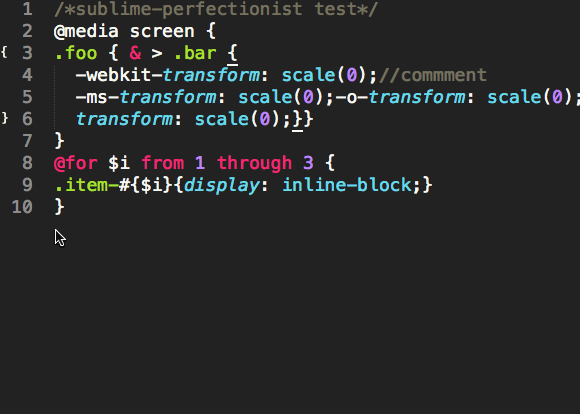

# [sublime-perfectionist](https://packagecontrol.io/packages/Perfectionist)

> A powerful Sublime Text plugin to beautify your CSS!

Powered by [perfectionist](https://github.com/ben-eb/perfectionist)




**Input:**

```css
/*sublime-perfectionist test*/
@media screen {
.foo { & > .bar {
  -webkit-transform: scale(0);/*commment*/
  -ms-transform: scale(0);-o-transform: scale(0);
  transform: scale(0);}}
}
```

**Output:**

```css
/*sublime-perfectionist test*/

@media screen {
  .foo {
    & > .bar {
      -webkit-transform: scale(0); /*commment*/
          -ms-transform: scale(0);
           -o-transform: scale(0);
              transform: scale(0);
    }
  }
}
```

## Installation

**First of all, you need to have [Node.js](https://nodejs.org/) installed.**

Make sure it's in your `$PATH` by running `node -v` in your command-line.

> Note: On OS X it's expected that Node should reside in the `/usr/local/bin/` folder, 
which it does when installed with the default installer. If this is not the case,
symlink your Node binary to this location. For example, if you used nvm:  
`ln -s -f /Users/#{username}/.nvm/versions/#{nodeVersion}/bin/node /usr/local/bin/node`  
See also: http://weibo.com/1397442732/BA52YbcdG


### Method 1: Package Control(Recommend)

You need to have `Package Control` installed.

* Open: `View > Show Console` menu.
* Paste the appropriate Python code for your version of Sublime Text into the console.

Sublime Text 3:


> import urllib.request,os,hashlib; h = 'eb2297e1a458f27d836c04bb0cbaf282' + 'd0e7a3098092775ccb37ca9d6b2e4b7d'; pf = 'Package Control.sublime-package'; ipp = sublime.installed_packages_path(); urllib.request.install_opener( urllib.request.build_opener( urllib.request.ProxyHandler()) ); by = urllib.request.urlopen( 'http://packagecontrol.io/' + pf.replace(' ', '%20')).read(); dh = hashlib.sha256(by).hexdigest(); print('Error validating download (got %s instead of %s), please try manual install' % (dh, h)) if dh != h else open(os.path.join( ipp, pf), 'wb' ).write(by)


Sublime Text 2:

> import urllib2,os,hashlib; h = 'eb2297e1a458f27d836c04bb0cbaf282' + 'd0e7a3098092775ccb37ca9d6b2e4b7d'; pf = 'Package Control.sublime-package'; ipp = sublime.installed_packages_path(); os.makedirs( ipp ) if not os.path.exists(ipp) else None; urllib2.install_opener( urllib2.build_opener( urllib2.ProxyHandler()) ); by = urllib2.urlopen( 'http://packagecontrol.io/' + pf.replace(' ', '%20')).read(); dh = hashlib.sha256(by).hexdigest(); open( os.path.join( ipp, pf), 'wb' ).write(by) if dh == h else None; print('Error validating download (got %s instead of %s), please try manual install' % (dh, h) if dh != h else 'Please restart Sublime Text to finish installation')

Then

1. Open the Command Palette: `Cmd + Shift + P`(OS X) or `Ctrl + Shift + P`(Window/Linux).
2. Input: `Package Control: Install Package` or just `pcip`.
3. Input: `perfectionist`.
4. Windows users will need to restart Sublime Text to finish the installation.


### Method 2: Install from GitHub

1. Run the following command in your Sublime Text packages directory 
```
$ git clone https://github.com/yisibl/sublime-perfectionist perfectionist
```
2. Depending on your OS (and Sublime Text version), the packages directories are 

  * Windows: `cd %APPDATA%\Sublime Text 3\Packages`
  * OS X: `cd ~/Library/Application\ Support/Sublime\ Text\ 3/Packages`
  * Linux: `cd ~/.config/sublime-text-3/packages`

### Method 3: Download

1. Download the [source zip](https://github.com/yisibl/sublime-perfectionist/archive/master.zip) from Github.
2. Open Sublime Text menu `Preferences > Browse Packages`.
3. Extract it into a new folder named 'perfectionist' in your Sublime Text "Packages" folder.
4. Restart Sublime Text.


## Usage

* Open the Command Palette: `Cmd + Shift + P`(OS X) or `Ctrl + Shift + P`(Window/Linux), input `CSS Perfectionist`.
* Context Menu: `CSS perfectionist`.
* Shortcut keys: `Cmd + Shift + E`(OS X)/`Ctrl + Shift + E`(Window/Linux).

## Options

### format_on_save

* Type: `boolean`
* Default: `true`

Automatically format when a file is saved.

### file_filter

* Type: `string`
* Default: `css,scss,less,html,htm`

If `format_on_save` is true, automatic formatting in these files.

More options, see also: https://github.com/ben-eb/perfectionist#options

## Settings

1. Open `Preferences` > `Package Settings` > `Perfectionist` > `Settings - Default`.
2. Copy code.
3. Open `Preferences` > `Package Settings` > `Perfectionist` > `Settings - User`.
4. Paste and modify.

## Acknowledgements

This plugin is based on the excellent [Autoprefixer plugin](https://github.com/sindresorhus/sublime-autoprefixer) by Sindre Sorhus.

Thank [@Ovilia](https://github.com/Ovilia/) for reviewing the document.

* [如何开发Sublime Text2插件](http://www.welefen.com/how-to-develop-sublime-text-plugin.html)
* [sublime插件开发手记](http://www.hickwu.com/sublime%E6%8F%92%E4%BB%B6%E5%BC%80%E5%8F%91%E6%89%8B%E8%AE%B0)
* [Sublime插件API手册 ](http://mux.alimama.com/posts/549)
* [sublime插件开发](http://mux.alimama.com/posts/541)

## License

MIT License

Created by [yisibl](https://github.com/yisibl/) ([Weibo](http://weibo.com/jieorlin))
